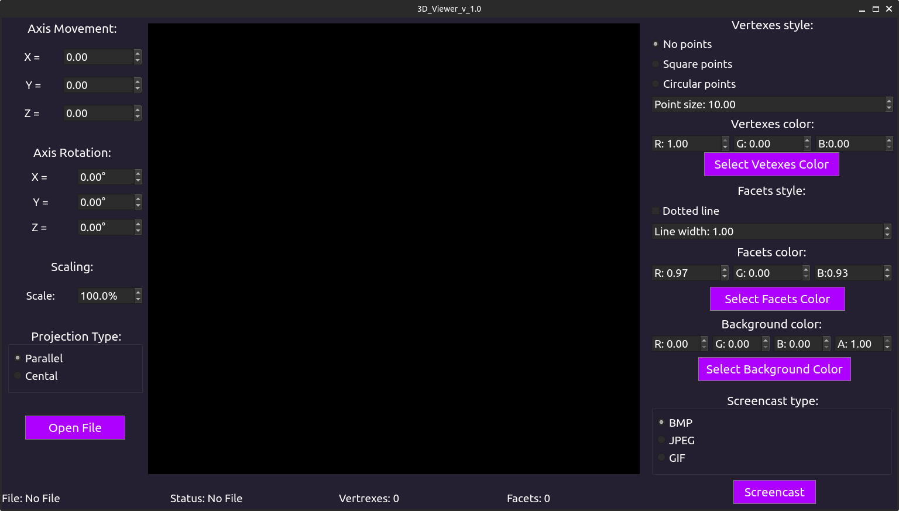
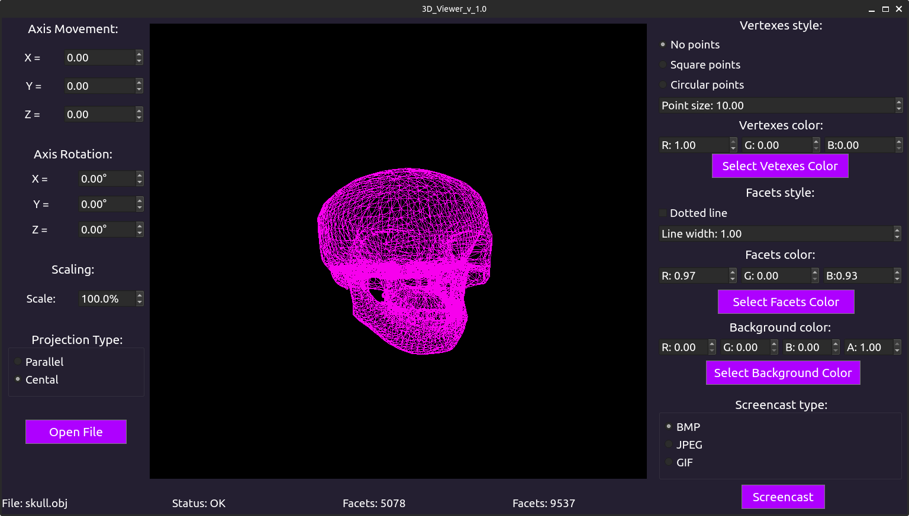

# 3DViewer v2.0 by tomokoki and bruscoaz <!-- omit in toc -->

Приложение для работы с 3D моделями, написанная на языке __C++__ с использованием графической библиотеки __QT__.

## Contents <!-- omit in toc -->
- [Information:](#information)
- [Installation:](#installation)
- [Options:](#options)
- [Examples](#examples)

## Information:

В данном проекте была разработана программа для визуализации каркасной модели в трехмерном пространстве. 
Список шаблонов проектирования, использованных в проекте:
- MVC (Model-View-Controller);
- Singleton
- Strategy
- Template method

## Installation:

- Для установки вам необходимо перейти в дирректорию __src__ и в терминале выполнить команду `make install`. Приложение будет установленно в паку __build__, которая находится также в папке __src__;
- Чтобы выполнить деинтсаляцию - выполните команду `make uninstall`;
- Для формирования __tgz архива__ -  выполните команду `make dist`. Сформированный файл будет находиться в папке __dist__;
- Для просмотра документации _(данного файла)_ - выполните команду `make dvi`; 
- Для запуска тестов необходимо в терминале выполнить команду `make tests`;
- Чтобы посмотреть покрытие кода - выполните команду `make gcov_report`;

## Options:

Основы работы с приложением:
- Для начала работы необходимо открыть файл при помощи кнопки `"Open file"`. В предложенном диалоговом окне необходимо выбрать файл с расширением .obj;
- На панели __Axis Movement__ при помощи изменения значений компонентов SpinBox можно двигать модель по осям x, y, z;
- Изменение значений в панеле __Axis Rotation__ позволяет вращать модель по выбранной оси на введенное значение в градусах;
- Изменения поля __Scale__ позволяет масштабировать модель;
- Для изменения типа проекции нужно выбрать либо `Parallel` (параллельная), либо `Central` (центральная);
- __Панель Verexes style__ позволяет настраивать вершины. Вы можете выбрать вид их отображения (нет, квадрат, круг), выбрать их размер, изменив поле Poin Size, а также выбрать цвет - либо введя значения RGB в ручную, либо выбрав цвет из палитры, нажав на кнопку "Select Vertexes Color";
- __Панель Facets style__ неоходима для настройки отображения ребер. Поставив флаг в поле Dotted line, линии станут пунктирными, убрав его - линии снова станут сплошными. Line width позволяет задать толщину линий, также можно настроить цвет линий (аналогично дейстивям, описанным выше);
- __Панель Background Color__ - позволяет либо в ручную вбивать цвет заднего фона, либо через палитру при нажатии на кнопку `"Select Background Color"`;
- В панели __Screencast Type__ вы можете выбрать тип сохраняемого изображения: `bmp, jpeg или gif` изображение (640x480, 5 секунд, 10 кадров в секунду). Для записи необходимо выбрать нужную модель и нажать кнопку "Screencast";
- На нижней панеле приведена информация по текущей модели: 
    - __File:__ выводит имя файла;
    - __Status:__ выводит информацию о возможных ошибках, либо о том, что все прошло успешно;
    - __Vertexes:__ кол-во вершин у модели;
    - __Facets:__ кол-во ребер у модели;
- Также приложение автоматически сохраняет настройки между сессиями работы с приложением; 

## Examples

Начальный интерфейс:

Открытая модель:

